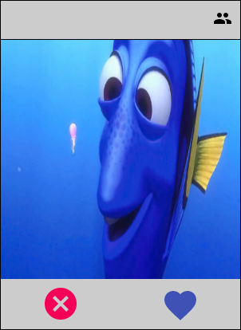
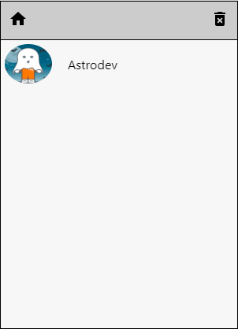

# Labematch
<p align="justify">Projeto baseado no tinder.

- # Link
http://labematch.arturmagalhaes.surge.sh/

- # Telas





                                                     
- # Tecnologias
  O projeto foi desenvolvido com ReactJS.
  - # Dependências
    - React Router DOM
    - Axios
    - Styled-components
    - Material-ui

- # Estrutura do projeto
  <p align="justify">O projeto foi dividido em duas páginas (Match e Matches).
  <p align="justify">Em Match aparecem as imagens dos usuários para dar ou não o match e se não houver mais usuários disponíveis no momento o sistema fica buscando até que um novo usuário seja adicionado ou que todos os matches sejam desfeitos.
  <p align="justify">Na página de Matches aparecem todos os usuários que deram match e é posível desfazer todos eles.
  
- # Como rodar o projeto
```bash
  $ git clone https://github.com/arturmmagalhaes/Labematch.git
  $ cd Labematch
  $ npm install
  $ npm run start
 ```
- # Como deployar o projeto
  ```bash
  $ npm run build
  $ surge ./build [url-desejada]
  ```
  
